# RLAD Developer Guide

## Table of Contents

1. [Acknowledgements](#1-acknowledgements)
2. [Setting Up the Project](#2-setting-up-the-project)
3. [Design](#3-design)
    - 3.1 [Architecture Overview](#31-architecture-overview)
    - 3.2 [Component Descriptions](#32-component-descriptions)
    - 3.3 [Class Diagram](#33-class-diagram)
4. [Implementation](#4-implementation)
    - 4.1 [Add Transaction](#41-add-transaction)
    - 4.2 [Delete Transaction](#42-delete-transaction)
    - 4.3 [Modify Transaction](#43-modify-transaction)
    - 4.4 [List and Filter Transactions](#44-list-and-filter-transactions)
    - 4.5 [Sort Transactions](#45-sort-transactions)
    - 4.6 [Summarize Transactions](#46-summarize-transactions)
    - 4.7 [Budget Management](#47-budget-management)
    - 4.8 [Storage Management (CSV Export/Import & Clear)](#48-storage-management-csv-exportimport--clear)
5. [Appendix A: Product Scope](#appendix-a-product-scope)
6. [Appendix B: User Stories](#appendix-b-user-stories)
7. [Appendix C: Non-Functional Requirements](#appendix-c-non-functional-requirements)
8. [Appendix D: Glossary](#appendix-d-glossary)
9. [Appendix E: Instructions for Manual Testing](#appendix-e-instructions-for-manual-testing)

---

## 1. Acknowledgements

- Architecture inspired by [AddressBook-Level2](https://github.com/se-edu/addressbook-level2) and [AddressBook-Level3](https://se-education.org/addressbook-level3/).
- Java `Predicate` chaining pattern adapted from the Java 8 Streams documentation.
- CSV storage design pattern adapted from the Storage feature proposal in the RLAD GitHub issue tracker.

---

## 2. Setting Up the Project

**Prerequisites:**
- JDK 17 or above
- IntelliJ IDEA (recommended) or any Java IDE

**Steps:**
1. Clone the repository.
2. Open IntelliJ and select **File > Open**, pointing to the project root.
3. Ensure the project SDK is set to JDK 17+.
4. Mark `src/main/java` as the **Sources Root**.
5. Run `seedu.RLAD.RLAD` as the main class.

**Building the JAR:**
```
./gradlew shadowJar
```
The output JAR is placed in `build/libs/`.

---
<div style="page-break-after: always;"></div>

## 3. Design

### 3.1 Architecture Overview

RLAD follows the **MVC (Model-View-Controller)** pattern combined with the **Command Design Pattern**.

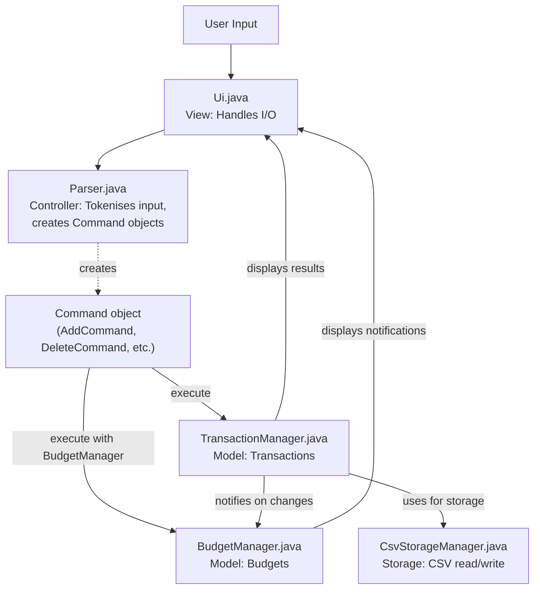
```mermaid
flowchart TD
    User[User Input] --> Ui[Ui.java<br/>View: Handles I/O]
    Ui --> Parser[Parser.java<br/>Controller: Tokenises input,<br/>creates Command objects]
    Parser -.->|creates| Command["Command object<br/>(AddCommand, DeleteCommand, etc.)"]

    Command -->|execute| TM[TransactionManager.java<br/>Model: Transactions]
    Command -->|execute with BudgetManager| BM[BudgetManager.java<br/>Model: Budgets]

    TM -->|notifies on changes| BM
    TM -->|uses for storage| Storage[CsvStorageManager.java<br/>Storage: CSV read/write]

    TM -->|displays results| Ui
    BM -->|displays notifications| Ui
```

**Main loop in `RLAD.java`:**
1. Read raw input via `Ui.readCommand()`.
2. Parse input via `Parser.parse()` to produce a `Command`.
3. Validate the command via `Command.hasValidArgs()`.
4. Execute the command via `Command.execute()`.
5. Display results via `Ui`.

---

### 3.2 Component Descriptions

#### `RLAD` (Application Controller)

The entry point. Initialises all components, wires them together, and runs the main event loop. Responsible for routing `BudgetCommand` to the overloaded `execute(TransactionManager, Ui, BudgetManager)` method.

#### `Ui` (View)

Handles all input and output. Reads user commands from stdin and provides `showResult()`, `showError()`, `showLine()`, and manual printing methods. Also provides `askConfirmation()` for destructive operations.

#### `Parser` (Controller / Factory)

Tokenises the raw input string into an action and argument string. Acts as a factory, returning a concrete `Command` subclass. Validates that the action is known and that argument-required commands are not invoked bare.

#### `Command` (Abstract Base)

Defines the command contract:
- `execute(TransactionManager, Ui)` — core execution.
- `execute(TransactionManager, Ui, BudgetManager)` — overload for budget-aware commands (defaults to calling the core method).
- `hasValidArgs()` — pre-flight validation.

#### `TransactionManager` (Transaction Model)

The in-memory store for transactions. Maintains a parallel `ArrayList<Transaction>` (preserving insertion order) and `HashMap<String, Transaction>` (O(1) lookup by HashID). Notifies `BudgetManager` on every add, delete, or update.

#### `Transaction`

An immutable-style data record holding type, category, amount, date, description, and a UUID-derived 6-character HashID. HashIDs are guaranteed unique via collision-prevention regeneration.

#### `BudgetManager` (Budget Model)

Stores `MonthlyBudget` objects keyed by `YearMonth`. Listens to transaction lifecycle events from `TransactionManager` to maintain accurate spending totals. Checks budget thresholds after each change and pushes warnings to `Ui`.

#### `MonthlyBudget`

Represents one month's budget: a map of `BudgetCategory -> Double` (allocated amounts) and a `totalIncome` field. Provides disposable income calculation.

#### `BudgetCategory` (Enum)

Defines the 12 fixed spending categories (Food, Transport, ..., Savings), each with a numeric code (1–12) and a display name.

#### `FilterCommand`

A shared utility command. Provides two static methods used by `ListCommand` and `SummarizeCommand`:
- `parseFlags(String)` — splits raw args on `--` boundaries into a key-value map.
- `buildPredicate(String)` — composes a `Predicate<Transaction>` from all active flags.

#### `TransactionSorter`

A stateless utility class. Provides `sort(List, field, direction)` returning a new sorted `ArrayList`. Valid fields: `amount`, `date`. Valid directions: `asc`, `desc`.

#### `CsvStorageManager` (Storage)

Handles all disk I/O. Exports transactions to CSV (with proper escaping) and imports from CSV (with validation, error tracking, and HashID regeneration). Returns an `ImportResult` value object containing success and failure counts.

---

### 3.3 Class Diagram

The following ASCII UML class diagrams capture the key relationships.

#### Core Architecture

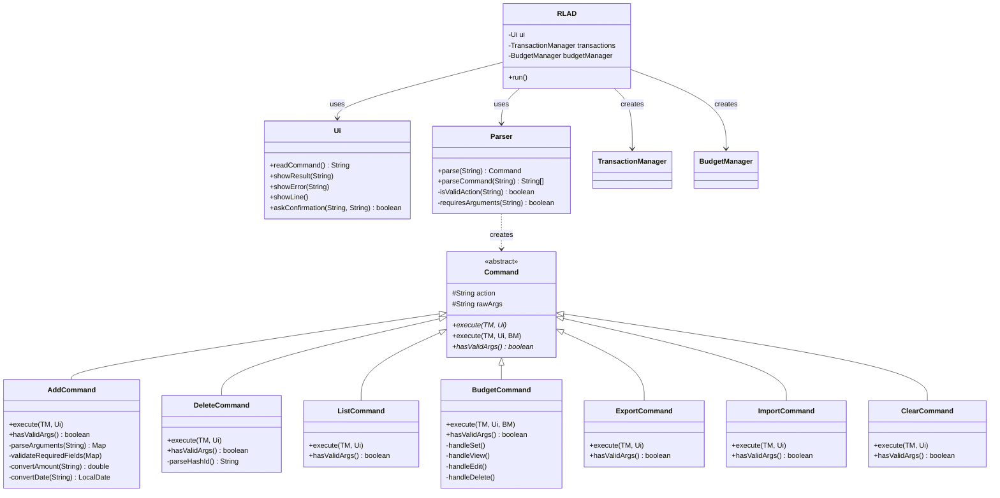
```mermaid
classDiagram
    class RLAD {
        -Ui ui
        -TransactionManager transactions
        -BudgetManager budgetManager
        +run()
    }

    class Ui {
        +readCommand() String
        +showResult(String)
        +showError(String)
        +showLine()
        +askConfirmation(String, String) boolean
    }

    class Parser {
        +parse(String) Command
        +parseCommand(String) String[]
        -isValidAction(String) boolean
        -requiresArguments(String) boolean
    }

    class Command {
        <<abstract>>
        #String action
        #String rawArgs
        +execute(TM, Ui)*
        +execute(TM, Ui, BM)
        +hasValidArgs()* boolean
    }

    class AddCommand {
        +execute(TM, Ui)
        +hasValidArgs() boolean
        -parseArguments(String) Map
        -validateRequiredFields(Map)
        -convertAmount(String) double
        -convertDate(String) LocalDate
    }

    class DeleteCommand {
        +execute(TM, Ui)
        +hasValidArgs() boolean
        -parseHashId() String
    }

    class ListCommand {
        +execute(TM, Ui)
        +hasValidArgs() boolean
    }

    class BudgetCommand {
        +execute(TM, Ui, BM)
        +hasValidArgs() boolean
        -handleSet()
        -handleView()
        -handleEdit()
        -handleDelete()
    }

    class ExportCommand {
        +execute(TM, Ui)
        +hasValidArgs() boolean
    }

    class ImportCommand {
        +execute(TM, Ui)
        +hasValidArgs() boolean
    }

    class ClearCommand {
        +execute(TM, Ui)
        +hasValidArgs() boolean
    }

    RLAD --> Ui : uses
    RLAD --> Parser : uses
    RLAD --> TransactionManager : creates
    RLAD --> BudgetManager : creates

    Parser ..> Command : creates

    Command <|-- AddCommand
    Command <|-- DeleteCommand
    Command <|-- ListCommand
    Command <|-- BudgetCommand
    Command <|-- ExportCommand
    Command <|-- ImportCommand
    Command <|-- ClearCommand
```

#### Transaction Model

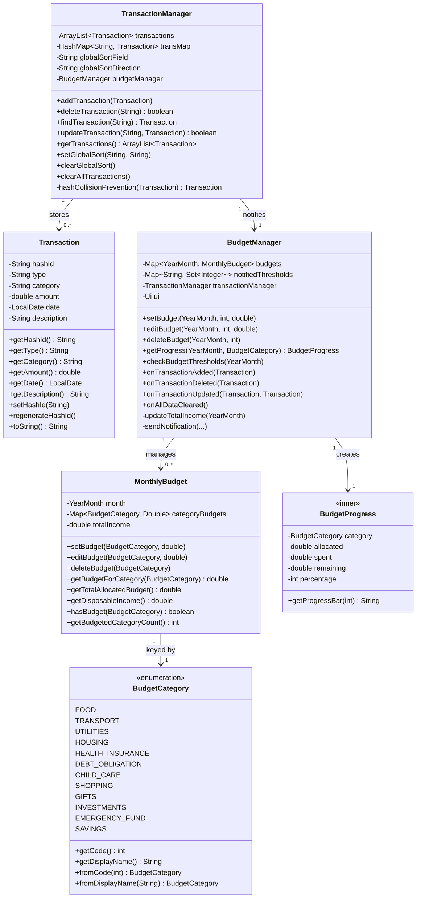
```mermaid
classDiagram
    class TransactionManager {
        -ArrayList~Transaction~ transactions
        -HashMap~String, Transaction~ transMap
        -String globalSortField
        -String globalSortDirection
        -BudgetManager budgetManager
        +addTransaction(Transaction)
        +deleteTransaction(String) boolean
        +findTransaction(String) Transaction
        +updateTransaction(String, Transaction) boolean
        +getTransactions() ArrayList~Transaction~
        +setGlobalSort(String, String)
        +clearGlobalSort()
        +clearAllTransactions()
        -hashCollisionPrevention(Transaction) Transaction
    }

    class Transaction {
        -String hashId
        -String type
        -String category
        -double amount
        -LocalDate date
        -String description
        +getHashId() String
        +getType() String
        +getCategory() String
        +getAmount() double
        +getDate() LocalDate
        +getDescription() String
        +setHashId(String)
        +regenerateHashId()
        +toString() String
    }

    class BudgetManager {
        -Map~YearMonth, MonthlyBudget~ budgets
        -Map~String, Set~Integer~~ notifiedThresholds
        -TransactionManager transactionManager
        -Ui ui
        +setBudget(YearMonth, int, double)
        +editBudget(YearMonth, int, double)
        +deleteBudget(YearMonth, int)
        +getProgress(YearMonth, BudgetCategory) BudgetProgress
        +checkBudgetThresholds(YearMonth)
        +onTransactionAdded(Transaction)
        +onTransactionDeleted(Transaction)
        +onTransactionUpdated(Transaction, Transaction)
        +onAllDataCleared()
        -updateTotalIncome(YearMonth)
        -sendNotification(...)
    }

    class MonthlyBudget {
        -YearMonth month
        -Map~BudgetCategory, Double~ categoryBudgets
        -double totalIncome
        +setBudget(BudgetCategory, double)
        +editBudget(BudgetCategory, double)
        +deleteBudget(BudgetCategory)
        +getBudgetForCategory(BudgetCategory) double
        +getTotalAllocatedBudget() double
        +getDisposableIncome() double
        +hasBudget(BudgetCategory) boolean
        +getBudgetedCategoryCount() int
    }

    class BudgetCategory {
        <<enumeration>>
        FOOD
        TRANSPORT
        UTILITIES
        HOUSING
        HEALTH_INSURANCE
        DEBT_OBLIGATION
        CHILD_CARE
        SHOPPING
        GIFTS
        INVESTMENTS
        EMERGENCY_FUND
        SAVINGS
        +getCode() int
        +getDisplayName() String
        +fromCode(int) BudgetCategory
        +fromDisplayName(String) BudgetCategory
    }

    class BudgetProgress {
        <<inner>>
        -BudgetCategory category
        -double allocated
        -double spent
        -double remaining
        -int percentage
        +getProgressBar(int) String
    }

    TransactionManager "1" --> "0..*" Transaction : stores
    TransactionManager "1" --> "1" BudgetManager : notifies
    BudgetManager "1" --> "0..*" MonthlyBudget : manages
    MonthlyBudget "1" --> "1" BudgetCategory : keyed by
    BudgetManager "1" --> "1" BudgetProgress : creates
```

#### Command Hierarchy

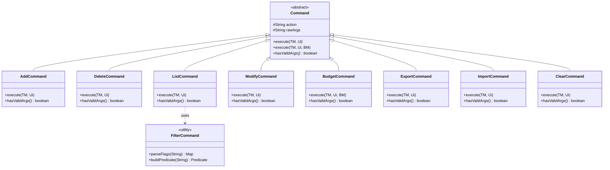
```mermaid
classDiagram
    class Command {
        <<abstract>>
        #String action
        #String rawArgs
        +execute(TM, Ui)*
        +execute(TM, Ui, BM)
        +hasValidArgs()* boolean
    }

    class AddCommand {
        +execute(TM, Ui)
        +hasValidArgs() boolean
    }

    class DeleteCommand {
        +execute(TM, Ui)
        +hasValidArgs() boolean
    }

    class ListCommand {
        +execute(TM, Ui)
        +hasValidArgs() boolean
    }

    class ModifyCommand {
        +execute(TM, Ui)
        +hasValidArgs() boolean
    }

    class BudgetCommand {
        +execute(TM, Ui, BM)
        +hasValidArgs() boolean
    }

    class ExportCommand {
        +execute(TM, Ui)
        +hasValidArgs() boolean
    }

    class ImportCommand {
        +execute(TM, Ui)
        +hasValidArgs() boolean
    }

    class ClearCommand {
        +execute(TM, Ui)
        +hasValidArgs() boolean
    }

    class FilterCommand {
        <<utility>>
        +parseFlags(String) Map
        +buildPredicate(String) Predicate
    }

    Command <|-- AddCommand
    Command <|-- DeleteCommand
    Command <|-- ListCommand
    Command <|-- ModifyCommand
    Command <|-- BudgetCommand
    Command <|-- ExportCommand
    Command <|-- ImportCommand
    Command <|-- ClearCommand

    ListCommand ..> FilterCommand : uses
```

#### Storage Component

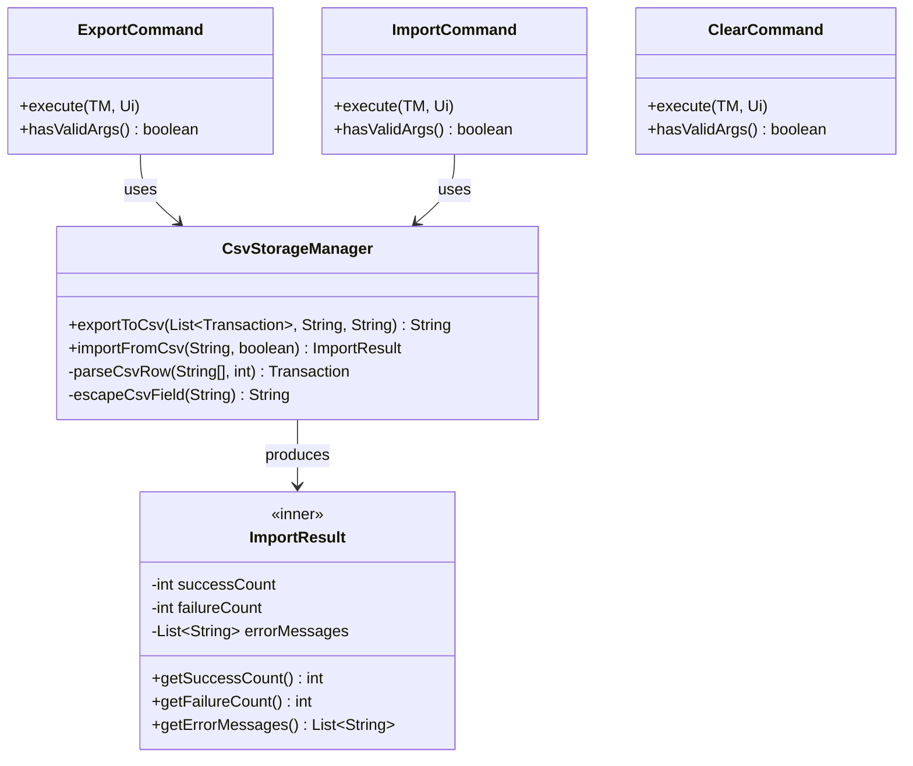
```mermaid
classDiagram
    class CsvStorageManager {
        +exportToCsv(List~Transaction~, String, String) String
        +importFromCsv(String, boolean) ImportResult
        -parseCsvRow(String[], int) Transaction
        -escapeCsvField(String) String
    }

    class ImportResult {
        <<inner>>
        -int successCount
        -int failureCount
        -List~String~ errorMessages
        +getSuccessCount() int
        +getFailureCount() int
        +getErrorMessages() List~String~
    }

    class ExportCommand {
        +execute(TM, Ui)
        +hasValidArgs() boolean
    }

    class ImportCommand {
        +execute(TM, Ui)
        +hasValidArgs() boolean
    }

    class ClearCommand {
        +execute(TM, Ui)
        +hasValidArgs() boolean
    }

    ExportCommand --> CsvStorageManager : uses
    ImportCommand --> CsvStorageManager : uses
    CsvStorageManager --> ImportResult : produces
```

---
<div style="page-break-after: always;"></div>

## 4. Implementation

### 4.1 Add Transaction (Position-Based Parsing)

**Classes involved:** `AddCommand`, `TransactionManager`, `BudgetManager`, `Transaction`

Instead of complex flag parsing with `--type`, RLAD now uses intuitive position-based arguments. The user simply types values in order, making the CLI feel natural and reducing the learning curve.

**Parsing strategy:**
1. Split input by spaces
2. First token = type (credit/debit)
3. Second token = amount (validated as positive number)
4. Third token = date (validated as YYYY-MM-DD)
5. Remaining tokens = category (single word) + description (may use quotes for spaces)

**Example parsing flow:**
```
Input: "add credit 3000 2026-03-01 salary March salary"
→ parts = ["add", "credit", "3000", "2026-03-01", "salary", "March", "salary"]
→ type = "credit"
→ amount = 3000.0
→ date = 2026-03-01
→ category = "salary"
→ description = "March salary" (joined remaining words)
```

**Quote handling for descriptions:**
```
Input: 'add debit 15.50 2026-03-05 food "Chicken rice at hawker"'
→ description = "Chicken rice at hawker" (preserves spaces)
```


**Sequence:**

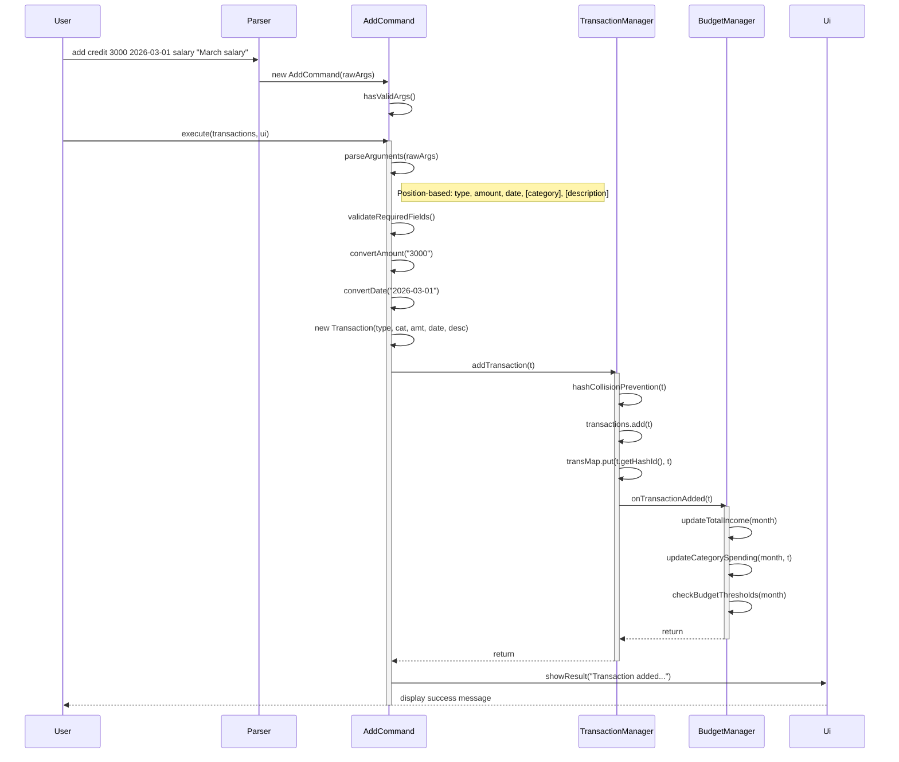
```mermaid
sequenceDiagram
    participant User
    participant Parser
    participant AddCommand
    participant TM as TransactionManager
    participant BM as BudgetManager
    participant Ui

    User->>Parser: add credit 3000 2026-03-01 salary "March salary"
    Parser->>AddCommand: new AddCommand(rawArgs)
    AddCommand->>AddCommand: hasValidArgs()

    User->>AddCommand: execute(transactions, ui)

    activate AddCommand
    AddCommand->>AddCommand: parseArguments(rawArgs)
    Note right of AddCommand: Position-based: type, amount, date, [category], [description]

    AddCommand->>AddCommand: validateRequiredFields()
    AddCommand->>AddCommand: convertAmount("3000")
    AddCommand->>AddCommand: convertDate("2026-03-01")
    AddCommand->>AddCommand: new Transaction(type, cat, amt, date, desc)

    AddCommand->>TM: addTransaction(t)
    activate TM

    TM->>TM: hashCollisionPrevention(t)
    TM->>TM: transactions.add(t)
    TM->>TM: transMap.put(t.getHashId(), t)

    TM->>BM: onTransactionAdded(t)
    activate BM
    BM->>BM: updateTotalIncome(month)
    BM->>BM: updateCategorySpending(month, t)
    BM->>BM: checkBudgetThresholds(month)
    BM-->>TM: return
    deactivate BM

    TM-->>AddCommand: return
    deactivate TM

    AddCommand->>Ui: showResult("Transaction added...")
    Ui-->>User: display success message
    deactivate AddCommand
```

**Design notes:**
- Intuitive order: Users naturally think "I spent $15.50 on food on March 5th" → `add debit 15.50 2026-03-05 food`
- Lower cognitive load: No need to remember flag names (`--type`, `--amount`, `--date`)
- Faster typing: Position-based parsing is more efficient for frequent users
- Consistent pattern: All commands follow similar simple patterns
- `AddCommand` is self-contained: it parses, validates, converts, and creates the `Transaction` internally. This keeps `TransactionManager` clean.
- `convertAmount()` enforces that the amount is positive and does not exceed 10,000,000.
- Dual-store (ArrayList + HashMap) ensures O(1) lookup while preserving insertion order for display.
- Budget notification is a side-effect of `addTransaction()` — commands do not need to be aware of the budget system.

---

### 4.2 Delete Transaction

**Classes involved:** `DeleteCommand`, `TransactionManager`, `BudgetManager`

**Sequence:**

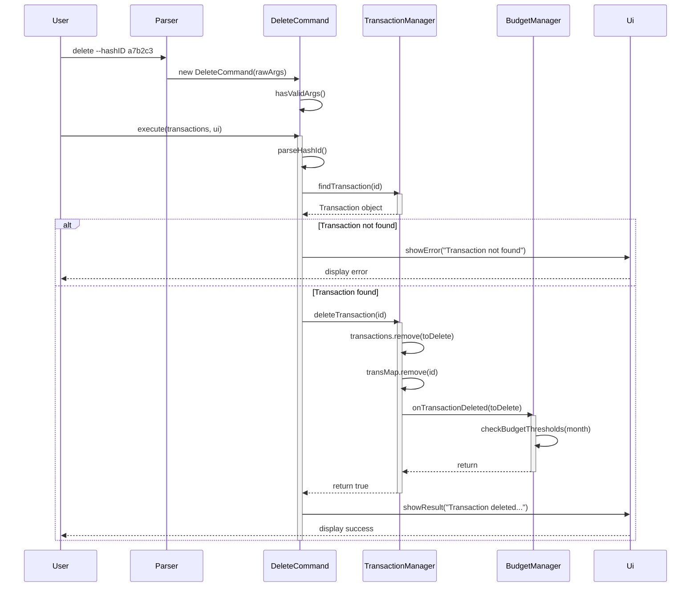
```mermaid
sequenceDiagram
    participant User
    participant Parser
    participant DeleteCommand
    participant TM as TransactionManager
    participant BM as BudgetManager
    participant Ui
    
    User->>Parser: delete --hashID a7b2c3
    Parser->>DeleteCommand: new DeleteCommand(rawArgs)
    DeleteCommand->>DeleteCommand: hasValidArgs()
    
    User->>DeleteCommand: execute(transactions, ui)
    
    activate DeleteCommand
    DeleteCommand->>DeleteCommand: parseHashId()
    
    DeleteCommand->>TM: findTransaction(id)
    activate TM
    TM-->>DeleteCommand: Transaction object
    deactivate TM
    
    alt Transaction not found
        DeleteCommand->>Ui: showError("Transaction not found")
        Ui-->>User: display error
    else Transaction found
        DeleteCommand->>TM: deleteTransaction(id)
        activate TM
        
        TM->>TM: transactions.remove(toDelete)
        TM->>TM: transMap.remove(id)
        
        TM->>BM: onTransactionDeleted(toDelete)
        activate BM
        BM->>BM: checkBudgetThresholds(month)
        BM-->>TM: return
        deactivate BM
        
        TM-->>DeleteCommand: return true
        deactivate TM
        
        DeleteCommand->>Ui: showResult("Transaction deleted...")
        Ui-->>User: display success
    end
    deactivate DeleteCommand
```

---

### 4.3 Modify Transaction

**Classes involved:** `ModifyCommand`, `TransactionManager`, `BudgetManager`, `Transaction`

**Sequence:**

```
Parser.parse("modify a7b2c3 --amount 20.00")
    |
    v
ModifyCommand(action, rawArgs) created
    |
    v
ModifyCommand.execute(transactions, ui)
    |
    |-- Parse rawArgs to extract ID and any update fields
    |-- transactions.findTransaction(id)
    |       -> Transaction old (or error if not found)
    |-- Construct updated Transaction with merged fields
    |       (unchanged fields copied from old)
    |-- transactions.updateTransaction(id, updated)
    |       -> transMap.put(id, updated)
    |       -> transactions.set(indexOf(old), updated)
    |       -> budgetManager.onTransactionUpdated(old, updated)
    |       -> budgetManager.checkBudgetThresholds(month)
    |
    v
ui.showResult("Transaction updated successfully!")
```

**Design notes:**
- The updated `Transaction` keeps the same HashID as the original (`setHashId` is called with the original ID before calling `updateTransaction`).
- Both the ArrayList position and the HashMap entry are updated atomically within `updateTransaction`.

---

### 4.4 List and Filter Transactions

**Classes involved:** `ListCommand`, `FilterCommand`, `TransactionSorter`, `TransactionManager`

**Sequence:**

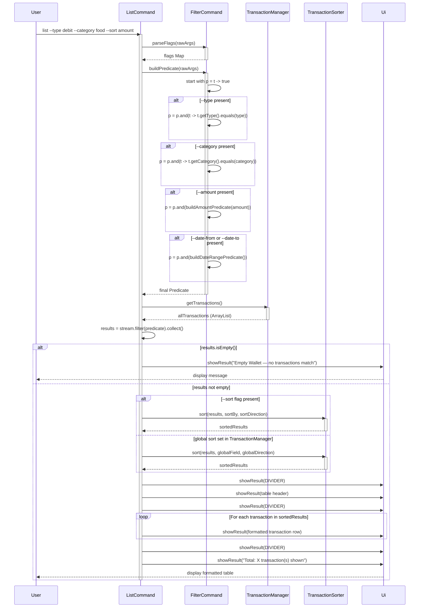
```mermaid
sequenceDiagram
    participant User
    participant ListCommand
    participant FilterCommand
    participant TM as TransactionManager
    participant Sorter as TransactionSorter
    participant Ui

    User->>ListCommand: list --type debit --category food --sort amount
    activate ListCommand

    ListCommand->>FilterCommand: parseFlags(rawArgs)
    activate FilterCommand
    FilterCommand-->>ListCommand: flags Map
    deactivate FilterCommand

    ListCommand->>FilterCommand: buildPredicate(rawArgs)
    activate FilterCommand

    FilterCommand->>FilterCommand: start with p = t -> true

    alt --type present
        FilterCommand->>FilterCommand: p = p.and(t -> t.getType().equals(type))
    end

    alt --category present
        FilterCommand->>FilterCommand: p = p.and(t -> t.getCategory().equals(category))
    end

    alt --amount present
        FilterCommand->>FilterCommand: p = p.and(buildAmountPredicate(amount))
    end

    alt --date-from or --date-to present
        FilterCommand->>FilterCommand: p = p.and(buildDateRangePredicate())
    end

    FilterCommand-->>ListCommand: final Predicate
    deactivate FilterCommand

    ListCommand->>TM: getTransactions()
    activate TM
    TM-->>ListCommand: allTransactions (ArrayList)
    deactivate TM

    ListCommand->>ListCommand: results = stream.filter(predicate).collect()

    alt results.isEmpty()
        ListCommand->>Ui: showResult("Empty Wallet — no transactions match")
        Ui-->>User: display message
    else results not empty

        alt --sort flag present
            ListCommand->>Sorter: sort(results, sortBy, sortDirection)
            activate Sorter
            Sorter-->>ListCommand: sortedResults
            deactivate Sorter
        else global sort set in TransactionManager
            ListCommand->>Sorter: sort(results, globalField, globalDirection)
            activate Sorter
            Sorter-->>ListCommand: sortedResults
            deactivate Sorter
        end

        ListCommand->>Ui: showResult(DIVIDER)
        ListCommand->>Ui: showResult(table header)
        ListCommand->>Ui: showResult(DIVIDER)

        loop For each transaction in sortedResults
            ListCommand->>Ui: showResult(formatted transaction row)
        end

        ListCommand->>Ui: showResult(DIVIDER)
        ListCommand->>Ui: showResult("Total: X transaction(s) shown")

        Ui-->>User: display formatted table
    end

    deactivate ListCommand
```

**How `FilterCommand.buildPredicate()` works:**

Predicates are composed using `Predicate.and()` — each active flag adds a new AND condition. The starting predicate is `t -> true` (match all), and each flag narrows it:

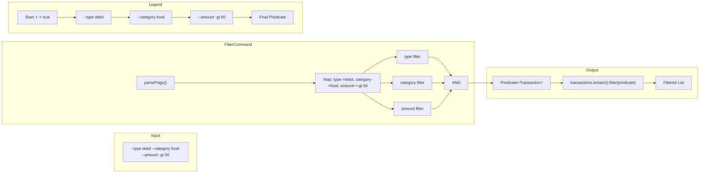
```mermaid
flowchart LR
    subgraph Input
        Args["--type debit --category food --amount -gt 50"]
    end

    subgraph FilterCommand
        Parse["parseFlags()"] --> Map["Map: type->debit, category->food, amount->-gt 50"]

        Map --> Type["type filter"]
        Map --> Cat["category filter"]
        Map --> Amt["amount filter"]

        Type --> And1["AND"]
        Cat --> And1
        Amt --> And1
    end

    subgraph Output
        And1 --> Predicate["Predicate&lt;Transaction&gt;"]
        Predicate --> Stream["transactions.stream().filter(predicate)"]
        Stream --> Results["Filtered List"]
    end

    subgraph Legend
        direction LR
        P["Start: t -> true"] --> T["--type debit"]
        T --> C["--category food"]
        C --> A["--amount -gt 50"]
        A --> R["Final Predicate"]
    end
```

This design means `FilterCommand` can be reused by any command that needs transaction filtering (currently `ListCommand` and `SummarizeCommand`).

**Sort priority:**
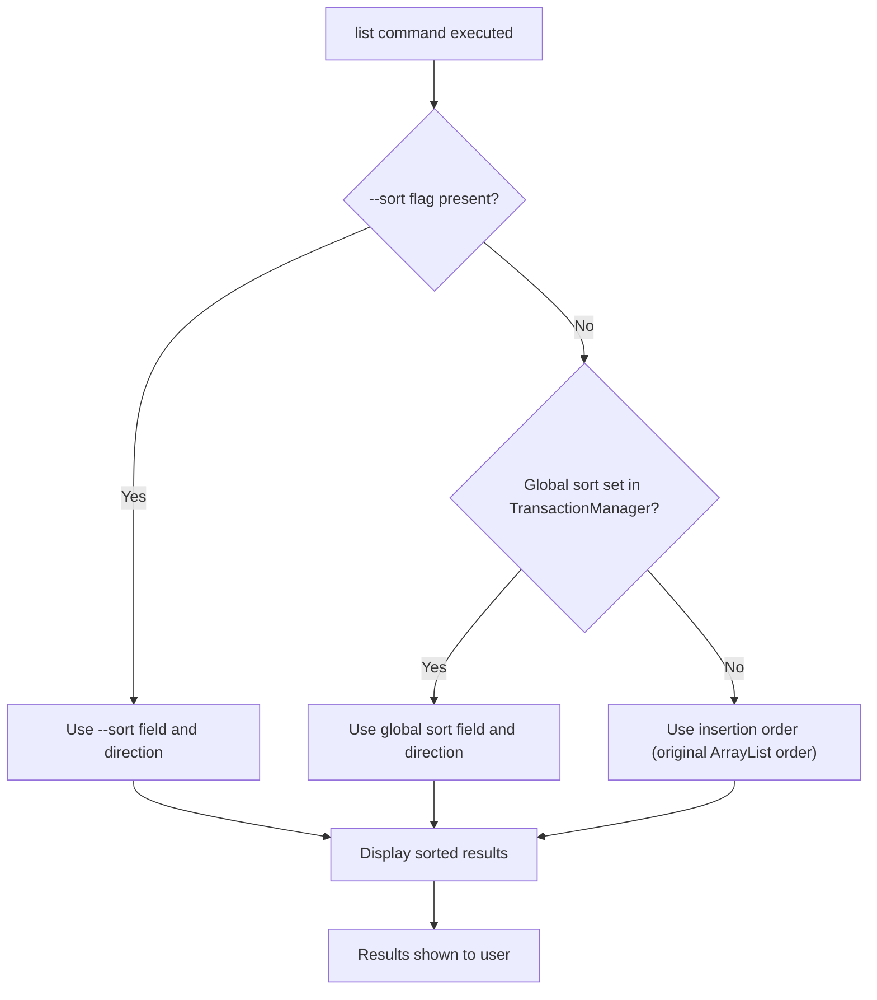
```mermaid
flowchart TD
    Start["list command executed"] --> CheckFlag{"--sort flag present?"}

    CheckFlag -->|Yes| FlagSort["Use --sort field and direction"]
    FlagSort --> Display["Display sorted results"]

    CheckFlag -->|No| CheckGlobal{"Global sort set in TransactionManager?"}
    CheckGlobal -->|Yes| GlobalSort["Use global sort field and direction"]
    GlobalSort --> Display

    CheckGlobal -->|No| InsertionOrder["Use insertion order (original ArrayList order)"]
    InsertionOrder --> Display

    Display --> End["Results shown to user"]
```
1. `--sort` flag in the `list` command (highest priority, one-time).
2. Global sort set via `sort` command (falls back if no `--sort` flag).
3. Insertion order (default if neither is set).

---

### 4.5 Sort Transactions

**Classes involved:** `SortCommand`, `TransactionManager`, `TransactionSorter`

`SortCommand` does not sort transactions itself — it writes the desired sort field and direction to `TransactionManager` via `setGlobalSort()`. `ListCommand` reads these stored values on each invocation.

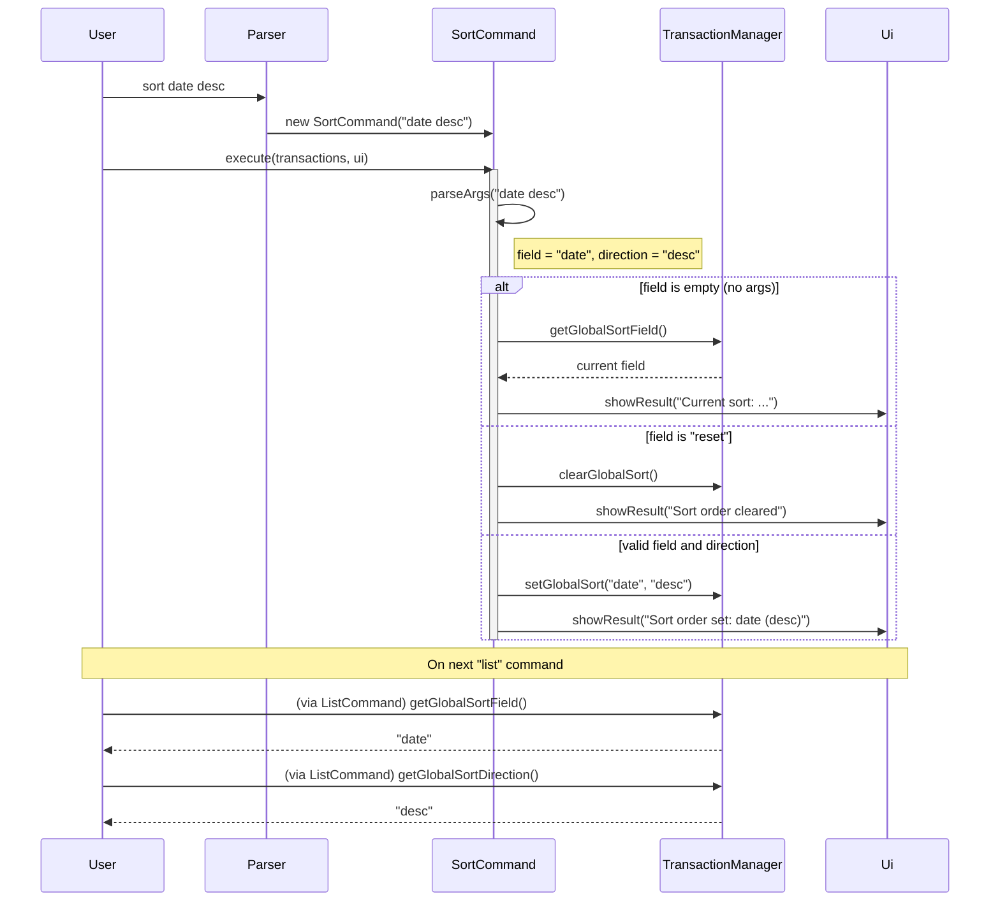
```mermaid
sequenceDiagram
    participant User
    participant Parser
    participant SortCommand
    participant TM as TransactionManager
    participant Ui

    User->>Parser: sort date desc
    Parser->>SortCommand: new SortCommand("date desc")

    User->>SortCommand: execute(transactions, ui)
    activate SortCommand

    SortCommand->>SortCommand: parseArgs("date desc")
    Note right of SortCommand: field = "date", direction = "desc"

    alt field is empty (no args)
        SortCommand->>TM: getGlobalSortField()
        TM-->>SortCommand: current field
        SortCommand->>Ui: showResult("Current sort: ...")
    else field is "reset"
        SortCommand->>TM: clearGlobalSort()
        SortCommand->>Ui: showResult("Sort order cleared")
    else valid field and direction
        SortCommand->>TM: setGlobalSort("date", "desc")
        SortCommand->>Ui: showResult("Sort order set: date (desc)")
    end

    deactivate SortCommand

    Note over User, Ui: On next "list" command
    User->>TM: (via ListCommand) getGlobalSortField()
    TM-->>User: "date"
    User->>TM: (via ListCommand) getGlobalSortDirection()
    TM-->>User: "desc"
```

---

### 4.6 Summarize Transactions

**Classes involved:** `SummarizeCommand`, `FilterCommand`

`SummarizeCommand` reuses `FilterCommand.buildPredicate()` identically to `ListCommand`, then aggregates filtered results:

```
summarize --date-from 2026-01-01 --date-to 2026-03-31
    |
    v
SummarizeCommand(rawArgs)
    |
    |-- FilterCommand.buildPredicate(rawArgs) -> Predicate
    |-- transactions.getTransactions().stream().filter(p).collect(toList())
    |
    |-- For each transaction:
    |       if credit: totalCredit += amount
    |       if debit:  totalDebit  += amount
    |       categoryTotals.merge(category, amount, BigDecimal::add)
    |
    |-- net = totalCredit - totalDebit
    |
    v
ui.showResult(formatted summary)
```

`BigDecimal` is used for all summation to avoid floating-point precision errors (e.g. `0.10 + 0.20 = 0.30` not `0.30000000000000004`). Category totals are grouped using `Map.merge()` with `BigDecimal::add`.

---

### 4.7 Budget Management

**Classes involved:** `BudgetCommand`, `BudgetManager`, `MonthlyBudget`, `BudgetCategory`, `TransactionManager`

#### Setting a Budget

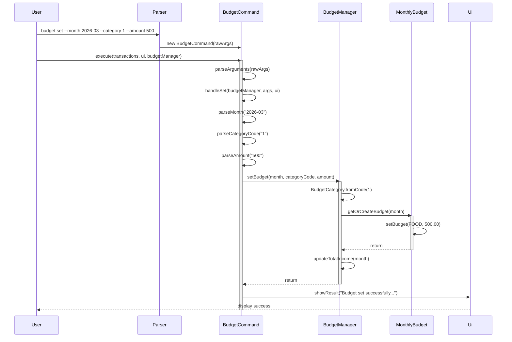
```mermaid
sequenceDiagram
    participant User
    participant Parser
    participant BudgetCommand
    participant BM as BudgetManager
    participant MonthlyBudget
    participant Ui

    User->>Parser: budget set --month 2026-03 --category 1 --amount 500
    Parser->>BudgetCommand: new BudgetCommand(rawArgs)

    User->>BudgetCommand: execute(transactions, ui, budgetManager)

    activate BudgetCommand
    BudgetCommand->>BudgetCommand: parseArguments(rawArgs)
    BudgetCommand->>BudgetCommand: handleSet(budgetManager, args, ui)

    BudgetCommand->>BudgetCommand: parseMonth("2026-03")
    BudgetCommand->>BudgetCommand: parseCategoryCode("1")
    BudgetCommand->>BudgetCommand: parseAmount("500")

    BudgetCommand->>BM: setBudget(month, categoryCode, amount)
    activate BM

    BM->>BM: BudgetCategory.fromCode(1)
    BM->>MonthlyBudget: getOrCreateBudget(month)
    activate MonthlyBudget

    MonthlyBudget->>MonthlyBudget: setBudget(FOOD, 500.00)
    MonthlyBudget-->>BM: return
    deactivate MonthlyBudget

    BM->>BM: updateTotalIncome(month)
    BM-->>BudgetCommand: return
    deactivate BM

    BudgetCommand->>Ui: showResult("Budget set successfully...")
    Ui-->>User: display success
    deactivate BudgetCommand
```

#### Budget Progress Tracking

`BudgetManager` reacts to transaction lifecycle events:

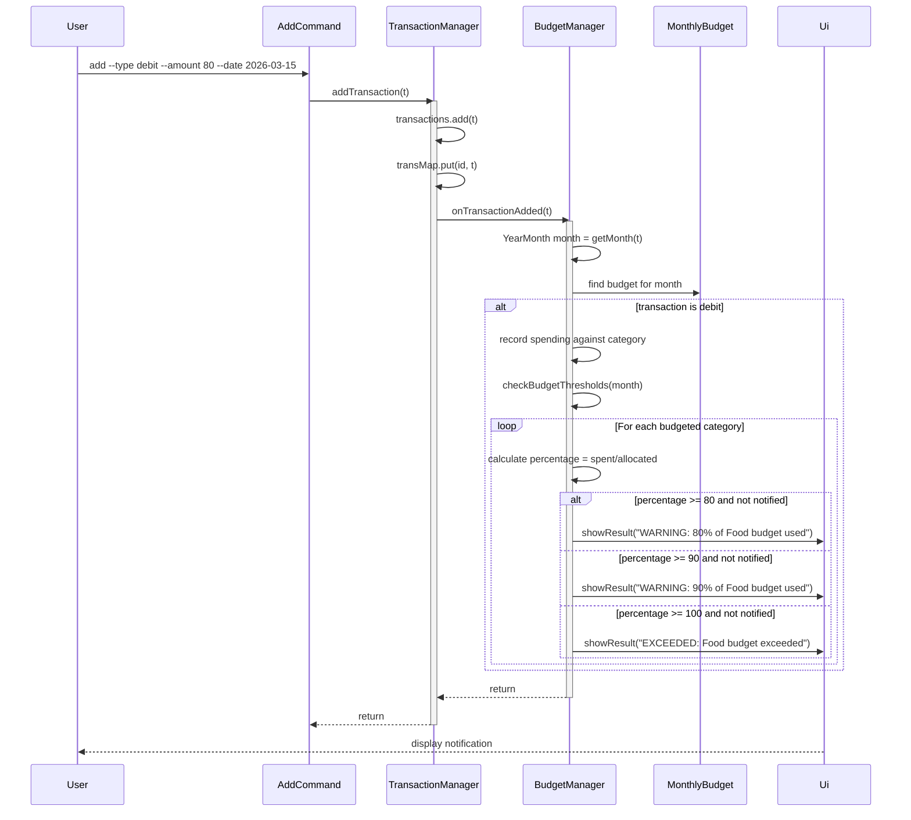
```mermaid
sequenceDiagram
    participant User
    participant AddCommand
    participant TM as TransactionManager
    participant BM as BudgetManager
    participant MonthlyBudget
    participant Ui

    User->>AddCommand: add --type debit --amount 80 --date 2026-03-15
    AddCommand->>TM: addTransaction(t)

    activate TM
    TM->>TM: transactions.add(t)
    TM->>TM: transMap.put(id, t)

    TM->>BM: onTransactionAdded(t)
    activate BM

    BM->>BM: YearMonth month = getMonth(t)
    BM->>MonthlyBudget: find budget for month
    activate MonthlyBudget

    alt transaction is debit
        BM->>BM: record spending against category
        BM->>BM: checkBudgetThresholds(month)

        loop For each budgeted category
            BM->>BM: calculate percentage = spent/allocated
            alt percentage >= 80 and not notified
                BM->>Ui: showResult("WARNING: 80% of Food budget used")
            else percentage >= 90 and not notified
                BM->>Ui: showResult("WARNING: 90% of Food budget used")
            else percentage >= 100 and not notified
                BM->>Ui: showResult("EXCEEDED: Food budget exceeded")
            end
        end
    end

    BM-->>TM: return
    deactivate BM
    TM-->>AddCommand: return
    deactivate TM

    Ui-->>User: display notification
```

#### Viewing Budget Progress

`BudgetManager.getProgress(month, category)` returns a `BudgetProgress` record containing:
- `allocated` — the budget amount set for the category
- `spent` — sum of all debit transactions in that month matching the category
- `remaining` — allocated - spent
- `percentage` — (spent / allocated) * 100
- `getProgressBar(length)` — renders a Unicode block progress bar

---

### 4.8 Storage Management (CSV Export/Import & Clear)

This feature is implemented across three new command classes and one new storage utility class.

#### 4.8.1 Export (`ExportCommand` + `CsvStorageManager.exportToCsv`)

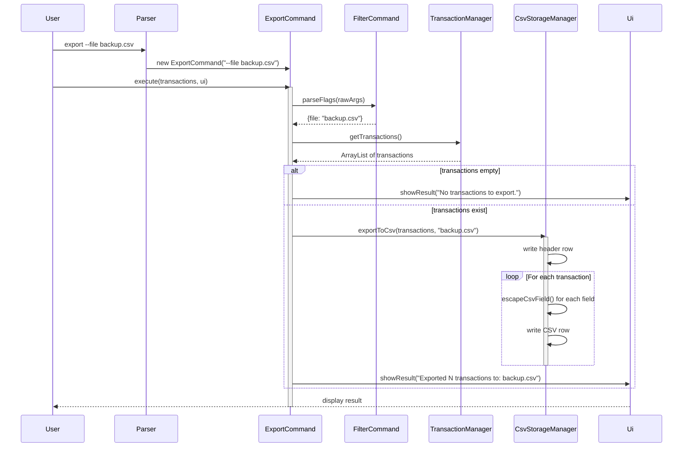
```mermaid
sequenceDiagram
    participant User
    participant Parser
    participant ExportCommand
    participant FilterCommand
    participant TM as TransactionManager
    participant CSV as CsvStorageManager
    participant Ui

    User->>Parser: export --file backup.csv
    Parser->>ExportCommand: new ExportCommand("--file backup.csv")

    User->>ExportCommand: execute(transactions, ui)
    activate ExportCommand

    ExportCommand->>FilterCommand: parseFlags(rawArgs)
    FilterCommand-->>ExportCommand: {file: "backup.csv"}

    ExportCommand->>TM: getTransactions()
    TM-->>ExportCommand: ArrayList of transactions

    alt transactions empty
        ExportCommand->>Ui: showResult("No transactions to export.")
    else transactions exist
        ExportCommand->>CSV: exportToCsv(transactions, "backup.csv")
        activate CSV
        CSV->>CSV: write header row
        loop For each transaction
            CSV->>CSV: escapeCsvField() for each field
            CSV->>CSV: write CSV row
        end
        deactivate CSV
        ExportCommand->>Ui: showResult("Exported N transactions to: backup.csv")
    end

    Ui-->>User: display result
    deactivate ExportCommand
```

**CSV escaping rules:**
- If a field contains a comma, double-quote, or newline, wrap it in double-quotes.
- Any existing double-quote characters within the field are doubled (`"` becomes `""`).

#### 4.8.2 Import (`ImportCommand` + `CsvStorageManager.importFromCsv`)

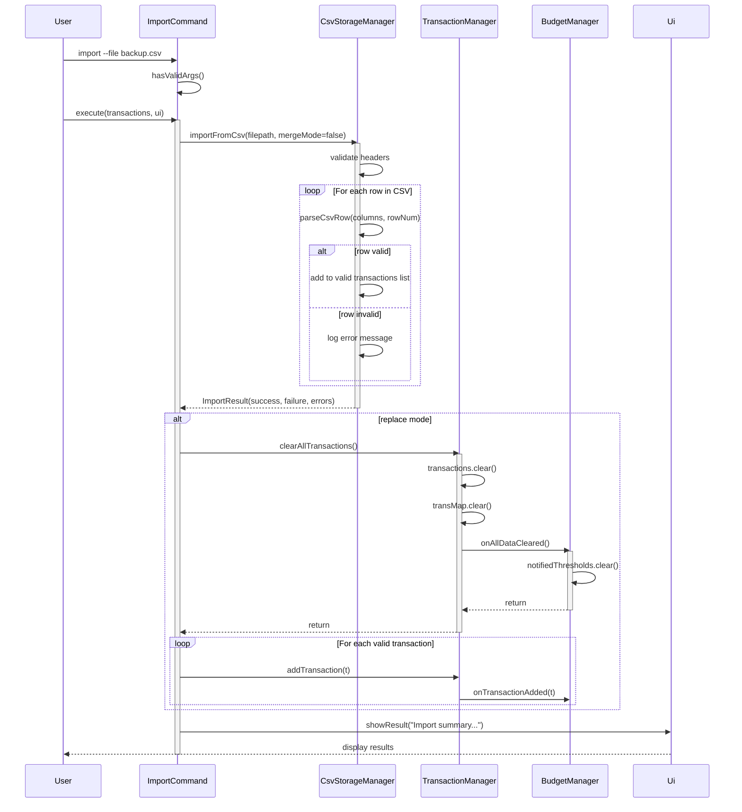
```mermaid
sequenceDiagram
    participant User
    participant ImportCommand
    participant CSV as CsvStorageManager
    participant TM as TransactionManager
    participant BM as BudgetManager
    participant Ui

    User->>ImportCommand: import --file backup.csv
    ImportCommand->>ImportCommand: hasValidArgs()

    User->>ImportCommand: execute(transactions, ui)

    activate ImportCommand
    ImportCommand->>CSV: importFromCsv(filepath, mergeMode=false)
    activate CSV

    CSV->>CSV: validate headers
    loop For each row in CSV
        CSV->>CSV: parseCsvRow(columns, rowNum)
        alt row valid
            CSV->>CSV: add to valid transactions list
        else row invalid
            CSV->>CSV: log error message
        end
    end

    CSV-->>ImportCommand: ImportResult(success, failure, errors)
    deactivate CSV

    alt replace mode
        ImportCommand->>TM: clearAllTransactions()
        activate TM
        TM->>TM: transactions.clear()
        TM->>TM: transMap.clear()
        TM->>BM: onAllDataCleared()
        activate BM
        BM->>BM: notifiedThresholds.clear()
        BM-->>TM: return
        deactivate BM
        TM-->>ImportCommand: return
        deactivate TM

        loop For each valid transaction
            ImportCommand->>TM: addTransaction(t)
            TM->>BM: onTransactionAdded(t)
        end
    end

    ImportCommand->>Ui: showResult("Import summary...")
    Ui-->>User: display results
    deactivate ImportCommand
```

#### 4.8.3 Clear (`ClearCommand`)

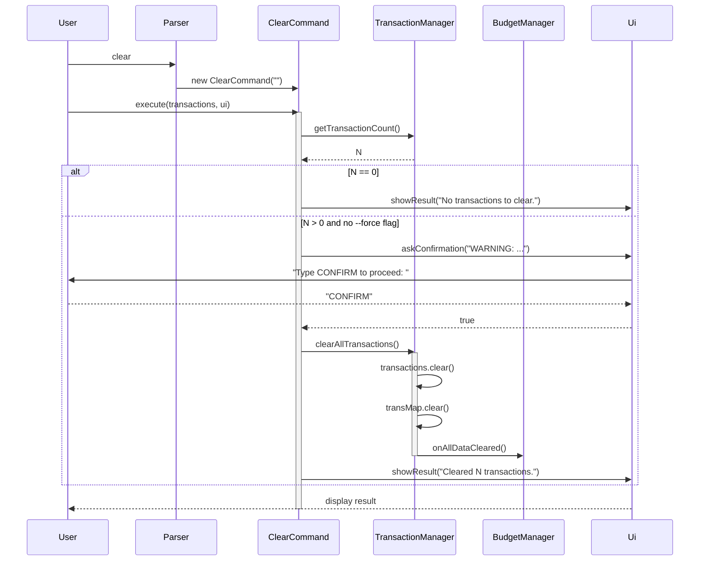
```mermaid
sequenceDiagram
    participant User
    participant Parser
    participant ClearCommand
    participant TM as TransactionManager
    participant BM as BudgetManager
    participant Ui

    User->>Parser: clear
    Parser->>ClearCommand: new ClearCommand("")

    User->>ClearCommand: execute(transactions, ui)
    activate ClearCommand

    ClearCommand->>TM: getTransactionCount()
    TM-->>ClearCommand: N

    alt N == 0
        ClearCommand->>Ui: showResult("No transactions to clear.")
    else N > 0 and no --force flag
        ClearCommand->>Ui: askConfirmation("WARNING: ...")
        Ui->>User: "Type CONFIRM to proceed: "
        User-->>Ui: "CONFIRM"
        Ui-->>ClearCommand: true

        ClearCommand->>TM: clearAllTransactions()
        activate TM
        TM->>TM: transactions.clear()
        TM->>TM: transMap.clear()
        TM->>BM: onAllDataCleared()
        deactivate TM

        ClearCommand->>Ui: showResult("Cleared N transactions.")
    end

    Ui-->>User: display result
    deactivate ClearCommand
```

#### Design Considerations

**Parser integration:** `export`, `import`, and `clear` are registered in `Parser.isValidAction()` and routed via the `parse()` switch. `import` requires arguments (`requiresArguments` returns true), while `export` and `clear` do not.

**Shared clearing logic:** Both `ClearCommand` and `ImportCommand` (replace mode) call `TransactionManager.clearAllTransactions()`, which clears both the ArrayList and HashMap, then notifies `BudgetManager.onAllDataCleared()` to reset notification tracking.

**Confirmation flow:** Destructive operations (`clear`, `import` in replace mode) use `Ui.askConfirmation(String)` to prompt the user to type `CONFIRM` before proceeding. The `clear --force` flag bypasses this prompt.

---

### 4.9 Autosave (Crash Recovery)

**Classes involved:** `AutoSaveManager`, `TransactionManager`, `RLAD`

RLAD automatically persists transaction data to a local file (`data/rlad.txt`) after every mutation (add, delete, modify, clear, import). On startup, `RLAD.java` calls `TransactionManager.loadFromAutoSave()` to restore the previous session's data.

This is separate from the CSV export/import feature — autosave is internal and automatic, while export/import is user-initiated and designed for data portability.

#### Save/Load Flow

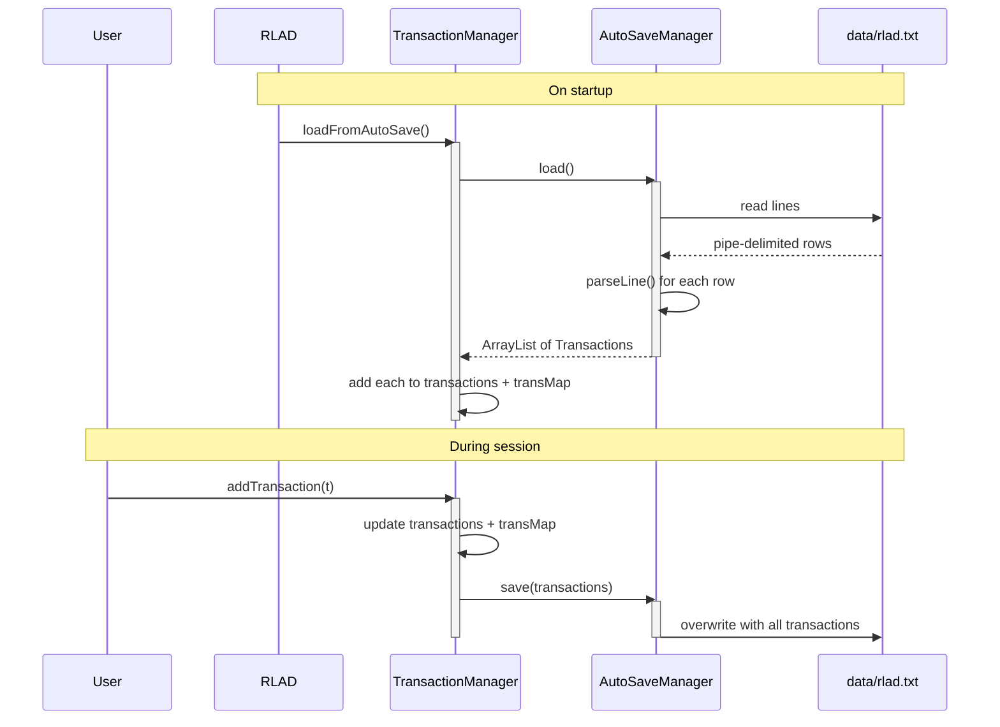
```mermaid
sequenceDiagram
    participant User
    participant RLAD
    participant TM as TransactionManager
    participant ASM as AutoSaveManager
    participant File as data/rlad.txt

    Note over RLAD, File: On startup
    RLAD->>TM: loadFromAutoSave()
    activate TM
    TM->>ASM: load()
    activate ASM
    ASM->>File: read lines
    File-->>ASM: pipe-delimited rows
    ASM->>ASM: parseLine() for each row
    ASM-->>TM: ArrayList of Transactions
    deactivate ASM
    TM->>TM: add each to transactions + transMap
    deactivate TM

    Note over User, File: During session
    User->>TM: addTransaction(t)
    activate TM
    TM->>TM: update transactions + transMap
    TM->>ASM: save(transactions)
    activate ASM
    ASM->>File: overwrite with all transactions
    deactivate ASM
    deactivate TM
```

#### File Format

Each transaction is stored as one line, fields separated by `|`:

```
hashId|type|category|amount|date|description
```

Example:
```
a7b2c3|debit|food|15.5|2026-03-05|Chicken rice at Clementi
d4e5f6|credit|salary|3000.0|2026-03-01|March salary
```

The description field is last, so pipes within descriptions are preserved (the parser limits the split to 6 fields).

#### Design Considerations

**Why not reuse CsvStorageManager?** CSV export/import is user-facing and designed for data portability (Excel, Sheets). Autosave is internal and optimised for speed and simplicity. Keeping them separate avoids coupling internal persistence with the user-facing export format.

**Why overwrite the entire file?** The transaction list is small enough that a full rewrite on every change is fast and avoids the complexity of incremental updates or journaling. This also guarantees the file is always in a consistent state.

**Graceful degradation:** If the autosave file is missing or corrupted, RLAD starts with an empty transaction list. Malformed lines are skipped with a log warning rather than crashing.

### 4.10 Help Command

**Classes involved:** `HelpCommand`, `Ui`

`HelpCommand` provides built-in usage instructions. When invoked with no arguments (`help`), it calls `Ui.printPossibleOptions()` to list all available commands. When invoked with a command name (e.g. `help add`), it calls the corresponding manual method in `Ui` (e.g. `Ui.printAddManual()`).

Supported commands: `add`, `modify`, `delete`, `list`, `filter`, `search`, `sort`, `summarize`, `budget`, `export`, `import`, `clear`, `help`, `exit`. Unrecognised command names produce an error message.

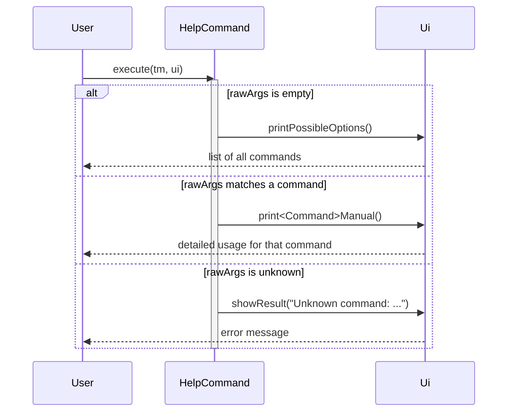
```mermaid
sequenceDiagram
    participant User
    participant HC as HelpCommand
    participant Ui

    User->>HC: execute(tm, ui)
    activate HC

    alt rawArgs is empty
        HC->>Ui: printPossibleOptions()
        Ui-->>User: list of all commands
    else rawArgs matches a command
        HC->>Ui: print<Command>Manual()
        Ui-->>User: detailed usage for that command
    else rawArgs is unknown
        HC->>Ui: showResult("Unknown command: ...")
        Ui-->>User: error message
    end

    deactivate HC
```

**Design notes:**
- All help text lives in `Ui`, keeping `HelpCommand` a thin dispatcher.
- Adding help for a new command requires one new `Ui` method and one new `case` in `HelpCommand`.

---
<div style="page-break-after: always;"></div>

## Appendix A: Product Scope

### Target User Profile

NUS students or young adults managing personal finances from the command line who prefer a lightweight tool over GUI apps or spreadsheets. The ideal user is comfortable with typed commands, values speed over visual polish, and wants to avoid subscription-based finance apps.

### Value Proposition

RLAD lets users record, filter, sort, and summarize financial transactions entirely from the terminal — faster than GUI apps for keyboard-driven users. The budget system provides proactive spending awareness, and CSV export/import enables data portability and compatibility with spreadsheet tools.

---
<div style="page-break-after: always;"></div>

## Appendix B: User Stories

| Version | As a ...      | I want to ...                                              | So that I can ...                                 |
|---------|---------------|------------------------------------------------------------|---------------------------------------------------|
| v1.0    | new user      | see usage instructions                                     | refer to them when I forget how to use the app    |
| v1.0    | user          | add income and expense transactions                        | track my cash flow                                |
| v1.0    | user          | delete a transaction by ID                                 | correct mistakes                                  |
| v1.0    | user          | list all my transactions                                   | review my spending history                        |
| v1.0    | user          | filter transactions by type, category, or date             | find specific records quickly                     |
| v1.0    | user          | sort transactions by amount or date                        | identify largest expenses or recent activity      |
| v1.0    | user          | see a financial summary                                    | understand my net balance and category spending   |
| v2.0    | user          | set a monthly budget per category                          | plan my spending in advance                       |
| v2.0    | user          | view budget progress with a visual progress bar            | see at a glance where I am overspending           |
| v2.0    | user          | edit or delete a budget                                    | adjust my plans when circumstances change         |
| v2.0    | user          | modify an existing transaction                             | correct wrong amounts or categories               |
| v2.0    | user          | export all my transactions to CSV                          | back up my data or analyse it in Excel            |
| v2.0    | user          | import transactions from a CSV file                        | restore a backup or migrate data                  |
| v2.0    | user          | merge imported data with existing transactions             | add bulk data without losing current records      |
| v2.0    | user          | clear all transaction data with confirmation               | start fresh without accidental data loss          |

---
<div style="page-break-after: always;"></div>

## Appendix C: Non-Functional Requirements

- **Performance:** All operations on up to 1,000 transactions must complete in under 1 second on a standard laptop (macOS/Windows/Linux, JDK 17).
- **Reliability:** HashID collision prevention must guarantee uniqueness across the session.
- **Portability:** The application must run on any OS with JDK 17+. No OS-specific APIs are used.
- **Data integrity:** CSV import must gracefully skip malformed rows without crashing. Failed rows are reported but do not abort the import.
- **Maintainability:** New commands must only require adding a new `Command` subclass and one `case` in `Parser`. The existing architecture must not require modification.
- **Usability:** All error messages must state the invalid input and what was expected. No stack traces are exposed to the user.

---
<div style="page-break-after: always;"></div>

## Appendix D: Glossary

| Term              | Definition                                                                                          |
|-------------------|-----------------------------------------------------------------------------------------------------|
| Transaction       | A financial record with type, amount, date, optional category and description.                      |
| HashID            | A 6-character unique identifier auto-generated for each transaction (e.g., `a7b2c3`).              |
| Credit            | A transaction representing money in (income).                                                       |
| Debit             | A transaction representing money out (expense).                                                     |
| Predicate         | A Java functional interface that returns `true`/`false` for a given Transaction. Used for filtering.|
| BudgetCategory    | One of 12 fixed spending categories defined in the `BudgetCategory` enum.                           |
| Disposable Income | Total recorded credits minus total allocated budget amounts for a given month.                      |
| Merge mode        | An import mode that adds imported transactions to existing data rather than replacing it.            |
| Global sort       | A persistent sort order stored in `TransactionManager` and applied to all `list` commands.          |
| ImportResult      | A value object returned by `CsvStorageManager` containing success count, failure count, and errors. |

---
<div style="page-break-after: always;"></div>

## Appendix E: Instructions for Manual Testing

> These tests verify core functionality. Run them in sequence on a fresh launch.

### E.1 Add Transactions

1. Add a credit:
   ```
   add --type credit --amount 3000.00 --date 2026-03-01 --category salary --description "March salary"
   ```
   Expected: success message with a HashID.

2. Add a debit:
   ```
   add --type debit --amount 15.50 --date 2026-03-05 --category food --description "Chicken rice"
   ```
   Expected: success message with a different HashID.

3. Add without optional fields:
   ```
   add --type debit --amount 5.00 --date 2026-03-06
   ```
   Expected: success. Category and Description show as `(none)`.

4. Add with invalid type:
   ```
   add --type cash --amount 10.00 --date 2026-03-07
   ```
   Expected: error message — Invalid `--type`.

### E.2 List and Filter

5. List all:
   ```
   list
   ```
   Expected: all 3 transactions shown.

6. Filter by type:
   ```
   list --type credit
   ```
   Expected: only the salary transaction.

7. Filter by amount:
   ```
   list --amount -gt 10.00
   ```
   Expected: salary ($3000) and chicken rice ($15.50) shown.

8. Filter by date range:
   ```
   list --date-from 2026-03-05 --date-to 2026-03-06
   ```
   Expected: chicken rice and the $5.00 debit shown.

9. Sort by amount descending:
   ```
   list --sort amount desc
   ```
   Expected: salary first, then chicken rice, then $5.00.

### E.3 Sort (Global)

10. Set global sort:
    ```
    sort amount asc
    ```
    Expected: confirmation message.

11. List (uses global sort):
    ```
    list
    ```
    Expected: transactions sorted by amount ascending.

12. Reset:
    ```
    sort reset
    ```

### E.4 Summarize

13. Summarize all:
    ```
    summarize
    ```
    Expected: Total Credit $3000, Total Debit $20.50, Net $2979.50.

### E.5 Modify

14. Note the HashID of the chicken rice transaction from step 2. Modify its amount:
    ```
    modify --hashID <ID> --amount 20.00 --description "Fancy chicken rice"
    ```
    Expected: success. Verify with `list`.

### E.6 Delete

15. Note the HashID of the $5.00 transaction. Delete it:
    ```
    delete --hashID <ID>
    ```
    Expected: success. Verify with `list` — only 2 transactions remain.

16. Attempt to delete with an invalid ID:
    ```
    delete --hashID zzzzzz
    ```
    Expected: error — Transaction not found.

### E.7 Budget

17. Set a food budget for March:
    ```
    budget set --month 2026-03 --category 1 --amount 200.00
    ```
    Expected: success.

18. View the budget:
    ```
    budget view --month 2026-03
    ```
    Expected: Food row with progress bar. Spent amount reflects debit transactions in March.

19. Edit the budget:
    ```
    budget edit --month 2026-03 --category 1 --amount 250.00
    ```
    Expected: success.

20. Delete the budget:
    ```
    budget delete --month 2026-03 --category 1
    ```
    Expected: success.

### E.8 Export

21. Export all transactions:
    ```
    export
    ```
    Expected: CSV file created with default filename. Open the file and verify rows match transactions.

22. Export with custom filename:
    ```
    export --file test_backup.csv
    ```
    Expected: file `test_backup.csv` created.

### E.9 Import

23. Import with replace mode:
    ```
    import --file test_backup.csv
    ```
    Expected: existing transactions replaced with imported ones. Counts match.

24. Add a new transaction, then merge:
    ```
    add --type debit --amount 50.00 --date 2026-03-10 --category transport
    import --file test_backup.csv --merge
    ```
    Expected: new transaction preserved, CSV transactions added on top.

25. Import a non-existent file:
    ```
    import --file nonexistent.csv
    ```
    Expected: error — file not found.

### E.10 Clear

26. Clear with confirmation:
    ```
    clear
    ```
    At the prompt, type `CONFIRM`.
    Expected: all transactions deleted. `list` shows empty.

27. Cancel clear:
    ```
    clear
    ```
    At the prompt, type anything other than `CONFIRM`.
    Expected: operation cancelled, data unchanged.

28. Force clear:
    ```
    clear --force
    ```
    Expected: all transactions deleted immediately, no prompt.

### E.11 Exit

29. Exit:
    ```
    exit
    ```
    Expected: farewell message and application terminates.